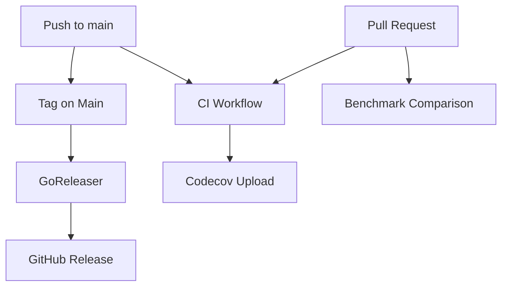

# GitHub Actions Workflows

This document describes the CI/CD workflows for the go-radx project.

## Workflows Overview

### 1. CI Workflow (`ci.yml`)

**Triggers:** Push to main, Pull Requests, Manual dispatch

This is the main continuous integration workflow that runs all quality checks:

#### Jobs:

1. **Lint & Format** - Code quality checks
   - Go formatting check (`gofmt`)
   - Linting with `golangci-lint`
   - Requires CGO dependencies for pixel decoders

2. **Test** - Comprehensive test suite
   - Runs all tests with coverage
   - Uploads coverage to Codecov
   - Includes integration tests with Docker/Testcontainers
   - Generates HTML coverage reports

3. **Coverage Check** - Portability test
   - Runs tests without CGO (ensures non-CGO code paths work)
   - Checks coverage threshold (informational)

4. **Benchmark** - Performance testing
   - Runs on PRs, main branch pushes, and manual dispatch
   - Compares PR benchmarks against base branch
   - Detects performance regressions >20%
   - Stores benchmark history on main branch

5. **Release Readiness** - Pre-release validation (PR only)
   - Validates GoReleaser configuration
   - Tests snapshot build
   - Ensures release artifacts can be built

### 2. Tag on Main Workflow (`release.yml`)

**Triggers:** Push to main branch (excluding docs/config changes)

Automatically creates version tags based on commit messages:

- `feat:` → Minor version bump (e.g., v1.2.0 → v1.3.0)
- `fix:`, `perf:`, `refactor:`, etc. → Patch version bump (e.g., v1.2.0 → v1.2.1)
- `BREAKING CHANGE` or `!` → Major version bump (e.g., v1.2.0 → v2.0.0)

**Important:** This workflow uses `GH_PAT` secret to trigger the GoReleaser workflow.

### 3. GoReleaser Workflow (`goreleaser.yml`)

**Triggers:** Tag push (v*.*.*), Manual dispatch

Creates GitHub releases with:
- Cross-platform binaries (Linux, macOS, Windows)
- ARM and AMD64 architectures
- CGO support via goreleaser-cross
- Docker images
- Changelog generation

### 4. Lint Workflow (`lint.yml`)

**Status:** ⚠️ Superseded by `ci.yml` - Can be removed

### 5. Security Workflow (`security.yml`)

**Triggers:** Push to main, Pull Requests, Weekly schedule

Runs security scans:
- CodeQL analysis
- Dependency vulnerability scanning
- SAST (Static Application Security Testing)

---

## Setting Up the PAT for GoReleaser Trigger

### Why is this needed?

GitHub Actions has a security feature that prevents workflows triggered by `GITHUB_TOKEN` from starting other workflows. This prevents infinite loops and unauthorized workflow chains.

The `Tag on Main` workflow creates tags, which should trigger `GoReleaser`, but won't work with the default token.

### Setup Instructions:

1. **Create a Personal Access Token (PAT)**
   - Go to GitHub Settings → Developer settings → Personal access tokens → Fine-grained tokens
   - Click "Generate new token"
   - Token name: `go-radx-workflow-trigger`
   - Expiration: Choose appropriate duration (recommend 1 year with renewal reminder)
   - Repository access: Select `codeninja55/go-radx`
   - Permissions:
     - Repository permissions:
       - `Contents`: Read and write
       - `Metadata`: Read-only (automatically selected)
       - `Workflows`: Read and write (this is critical!)
   - Generate token and copy it

2. **Add Token to Repository Secrets**
   - Go to `go-radx` repository settings
   - Secrets and variables → Actions
   - Click "New repository secret"
   - Name: `GH_PAT`
   - Value: Paste the token you copied
   - Click "Add secret"

3. **Verify the Setup**
   - Push a commit with a fix/feat message to main
   - Check that "Tag on Main" workflow runs
   - Verify that a new tag is created
   - Confirm that "GoReleaser" workflow triggers automatically

### Fallback Behavior

The workflow is configured with fallback:
```yaml
token: ${{ secrets.GH_PAT || secrets.GITHUB_TOKEN }}
```

- **With `GH_PAT`**: GoReleaser will trigger automatically ✅
- **Without `GH_PAT`**: Tag is created but GoReleaser must be triggered manually ⚠️

---

## Workflow Dependencies



---

## Running Workflows Manually

### Trigger CI with custom benchmark parameters:
```bash
gh workflow run ci.yml -f benchtime=5s -f count=10
```

### Trigger GoReleaser for a specific tag:
```bash
gh workflow run goreleaser.yml -f tag=v1.2.3
```

---

## Maintenance Notes

### CGO Dependencies

All workflows that run tests or linting install these CGO dependencies:
- `libjpeg-turbo8-dev` - JPEG Lossless decompression
- `libturbojpeg0-dev` - TurboJPEG library
- `libopenjp2-7-dev` - JPEG 2000 decompression
- `build-essential` - GCC compiler
- `pkg-config` - Library configuration

### Benchmark Artifacts

- Current benchmark results: Retained for 30 days
- Base benchmark results: Retained for 30 days
- Benchmark history (main only): Retained for 90 days

### Coverage Artifacts

- HTML coverage report: Retained for 30 days
- `coverage.out` file: Retained for 30 days

### Release Artifacts

- Snapshot builds (PRs): Retained for 7 days
- Release artifacts: Retained for 7 days
- GitHub Releases: Permanent (managed separately)

---

## Troubleshooting

### GoReleaser doesn't trigger after tag creation

**Symptom:** Tag is created but GoReleaser workflow doesn't run

**Solution:**
1. Verify `GH_PAT` secret is set
2. Check PAT has `workflows: write` permission
3. Ensure PAT hasn't expired

### Tests fail with "libjpeg not found"

**Symptom:** CGO build fails with missing library errors

**Solution:**
- Ensure workflow has "Install CGO dependencies" step
- Check that `mise deps:check` passes
- Verify `pkg-config --exists libjpeg` returns success

### Benchmark regression warning but no PR comment

**Symptom:** Workflow shows warning but PR has no benchmark comment

**Solution:**
- Check workflow has `pull-requests: write` permission
- Verify GitHub Actions bot has PR comment access
- Review Actions logs for API errors

---

## Migration from Old Workflows

If you're migrating from the old separate workflows:

1. **Keep for now:** `security.yml` (different purpose)
2. **Remove after testing:** `ci-mise.yml`, `benchmark.yml`, `test.yml`
3. **Update:** `release.yml` (add GH_PAT support)
4. **Add:** `ci.yml` (new unified workflow)

Test the new workflow on a feature branch first:
```bash
git checkout -b test/unified-workflow
# Make a trivial change
git commit -m "test: verify unified CI workflow"
git push -u origin test/unified-workflow
# Create PR and verify all jobs pass
```

Once verified, delete old workflows:
```bash
git rm .github/workflows/ci-mise.yml
git rm .github/workflows/benchmark.yml
git rm .github/workflows/test.yml
git commit -m "chore: remove old CI workflows (migrated to ci.yml)"
```